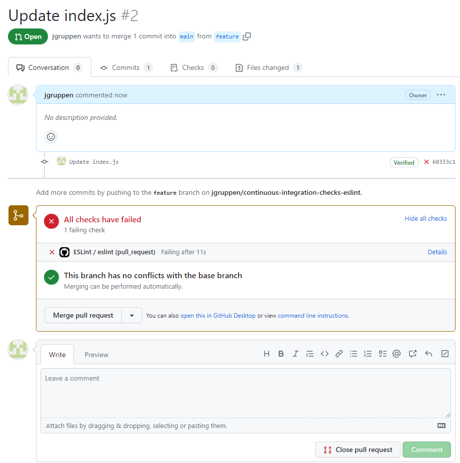

# Configuring Pull Request Validations

# The dish

To set up continuous integration (CI) checks on GitHub that automatically validate pull requests by running ESLint, you can follow these steps:

# Ingredients
- GitHub account
- GitHub repository

# Recipe

### 1. Configure ESLint
Ensure ESLint is properly set up in your project. Make sure you have an ESLint configuration file (e.g., `.eslintrc` or `.eslintrc.json`) in your project's repository to define the ESLint rules and settings.
### 2. Create a Workflow Configuration
In your GitHub repository, navigate to the `.github/workflows` directory (create it if it doesn't exist), and create a new YAML file, such as `eslint.yml`.
### 3. Add the following YAML code to define the workflow:
``` yml
name: ESLint Checks

on:
    pull_request:
      branches:
        - main

jobs:
  eslint:
    runs-on: ubuntu-latest

    steps:
    - name: Checkout code
      uses: actions/checkout@v2

    - name: Setup Node.js
      uses: actions/setup-node@v2
      with:
        node-version: 18

    - name: Install dependencies
      run: npm ci

    - name: Run ESLint
      run: npx eslint .
```

Here's what this workflow does:

- The workflow is triggered on pull requests targeting the main branch. You can modify the branches section to target a different branch if needed.
- The eslint job runs on the latest version of Ubuntu.
- The steps in the job are as follows:
    - Checking out the code from the repository.
    - Setting up Node.js with version 18.
    - Installing project dependencies using npm ci to ensure a clean install.
    - Running ESLint using the npx eslint . command, which lints all files in the repository.

### 4. Save the workflow file.

With this setup, every time a pull request is opened targeting the main branch, GitHub Actions will automatically run ESLint on the code changes introduced by the pull request. The ESLint results will be displayed as part of the pull request checks, helping you ensure that the code adheres to the defined linting rules.



You can commit and push the workflow file to your repository, and the CI checks will be activated. You can also view the status and results of the ESLint checks in the "Checks" section of the pull requests on GitHub.

# Use case
Ensure that code changes introduced through pull requests adhere to the project's ESLint rules.
